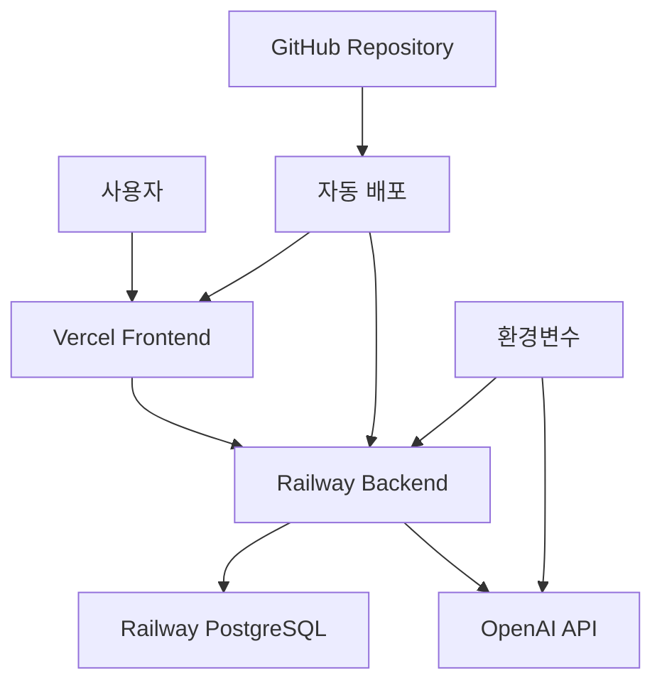

# 🎹 KLUE - AI 키보드 소믈리에 시스템

> **AI Tony와 함께하는 맞춤형 키보드 추천 플랫폼 - 149개 부품 데이터베이스 기반**


## 🌟 라이브 데모

- **🌐 프론트엔드**: [https://klueclient.vercel.app](https://klueclient.vercel.app)
- **🔧 백엔드 API**: [https://klue-keyboard-production.up.railway.app](https://klue-keyboard-production.up.railway.app)
- **📊 API 상태**: [Health Check](https://klue-keyboard-production.up.railway.app/actuator/health)

## 📋 목차

- [시스템 개요](#-시스템-개요)
- [주요 기능](#-주요-기능)
- [기술 스택](#-기술-스택)
- [API 문서](#-api-문서)
- [배포 아키텍처](#-배포-아키텍처)
- [데이터베이스](#-데이터베이스)
- [AI 기능](#-ai-기능)
- [개발 및 배포](#-개발-및-배포)

## 🎯 시스템 개요

**KLUE**는 OpenAI GPT-3.5-turbo를 활용한 AI 키보드 소믈리에 **Tony**가 사용자 맞춤형 키보드를 추천해주는 플랫폼입니다.

### 🚀 핵심 특징

- **🤖 AI 소믈리에 Tony**: 자연어로 대화하며 전문적인 키보드 추천
- **📊 149개 부품 데이터베이스**: PCB, 플레이트, 스위치, 키캡, 케이블 등
- **🌍 풀스택 클라우드 배포**: Vercel + Railway + PostgreSQL
- **🔗 실시간 API**: RESTful API로 모든 기능 제공

## 🎮 주요 기능

### 1. 🤖 AI 키보드 소믈리에 Tony

```javascript
// 자연어 대화 예시
사용자: "사무용 조용한 키보드 추천해줘"
Tony: "사무용으로 조용하고 편안한 사용을 위해 메커니컬 키보드 대신
       무소음 기능이 있는 멤브레인 키보드를 추천합니다..."
```

- **자연어 처리**: 편한 말투로 키보드 요청
- **전문적 추천**: 용도, 예산, 환경에 맞는 상세 가이드
- **실시간 AI**: OpenAI GPT-3.5-turbo 실시간 연동

### 2. 📦 포괄적 부품 데이터베이스

| 부품 카테고리      | 개수 | 특징                                |
| ------------------ | ---- | ----------------------------------- |
| 🔘 **Switches**    | 32개 | Linear, Tactile, Clicky 타입별 분류 |
| ⌨️ **Keycaps**     | 25개 | 다양한 프로파일과 재질              |
| 🧊 **PCB**         | 10개 | 레이아웃별 호환성 정보              |
| 📱 **Cases**       | 10개 | 마운트 방식별 분류                  |
| 🔲 **Plates**      | 20개 | 재질별 타건감 차이                  |
| 🔌 **Cables**      | 6개  | 커넥터 타입별                       |
| 🛡️ **Stabilizers** | 12개 | PCB 마운트/플레이트 마운트          |
| 📊 **기타 부품**   | 34개 | 가스켓, 폼, 스위치 오프너 등        |

### 3. 🌐 실시간 웹 인터페이스

- **반응형 디자인**: 모바일/데스크톱 최적화
- **실시간 검색**: 부품별 필터링 및 검색
- **상세 정보**: 각 부품의 스펙과 특징
- **직관적 UI**: 사용자 친화적 인터페이스

## 🔧 기술 스택

### Frontend (Vercel)

```typescript
React 18 + TypeScript
├── 상태 관리: React Hooks
├── 스타일링: CSS Modules
├── HTTP 클라이언트: Fetch API
└── 배포: Vercel (자동 배포)
```

### Backend (Railway)

```java
Spring Boot 3.4.5
├── 웹 프레임워크: Spring MVC
├── 데이터 액세스: Spring Data JPA
├── AI 연동: OpenAI API (GPT-3.5-turbo)
├── 데이터베이스: PostgreSQL
└── 배포: Railway (자동 배포)
```

### Database (Railway PostgreSQL)

```sql
PostgreSQL 클라우드 인스턴스
├── 149개 부품 데이터
├── 자동 백업
├── 고가용성 설정
└── 환경변수 기반 연결
```

## 📡 API 문서

### 🏥 헬스체크

```bash
GET /actuator/health
# 응답: {"status": "UP", "components": {...}}
```

### 🤖 AI 추천 시스템

```bash
# AI 추천 (OpenAI 연동)
POST /api/recommendations/by-condition
Content-Type: application/json
{
  "condition": "게이밍용 키보드 추천해줘"
}

# 응답
{
  "condition": "게이밍용 키보드 추천해줘",
  "switchType": "클릭 스위치",
  "reason": "게이밍용으로 높은 성능을 요구하는 경우...",
  "ai_powered": true,
  "message": "AI Tony가 추천했습니다"
}
```

### 📦 부품 데이터베이스

```bash
# 스위치 목록
GET /api/switches
GET /api/switches/{id}

# 키캡 목록
GET /api/keycaps
GET /api/keycaps/{id}

# PCB 목록
GET /api/pcbs
GET /api/pcbs/{id}

# 플레이트 목록
GET /api/plates
GET /api/plates/{id}

# 케이스 목록
GET /api/cases
GET /api/cases/{id}

# 기타 부품들
GET /api/stabilizers
GET /api/cables
GET /api/gaskets
GET /api/foams
```

### 🔍 검색 및 필터링

```bash
# 페이지네이션 지원
GET /api/switches?page=0&size=10&sort=name

# 응답 형식
{
  "switches": [...],
  "currentPage": 0,
  "totalPages": 4,
  "totalItems": 32,
  "pageSize": 10,
  "isFirst": true,
  "isLast": false
}
```

## 🏗️ 배포 아키텍처



### 🌍 프로덕션 환경

- **Frontend**: Vercel (CDN + Edge Network)
- **Backend**: Railway (Container 기반 배포)
- **Database**: Railway PostgreSQL (클라우드 관리형)
- **AI**: OpenAI API (GPT-3.5-turbo)
- **CI/CD**: GitHub → 자동 배포

## 💾 데이터베이스

### 📊 엔티티 관계도

```
KeyboardCase (1) ←→ (N) PCB
KeyboardCase (1) ←→ (N) Plate
PCB (N) ←→ (N) Switch
Switch (N) ←→ (N) Keycap
```

### 🔧 주요 테이블

```sql
-- 149개 부품 분포
SELECT
  'Switches' as category, COUNT(*) as count FROM switches
UNION ALL
SELECT 'Keycaps', COUNT(*) FROM keycaps
UNION ALL
SELECT 'PCBs', COUNT(*) FROM pcbs
UNION ALL
SELECT 'Cases', COUNT(*) FROM keyboard_cases
UNION ALL
SELECT 'Plates', COUNT(*) FROM plates
-- ... 총 149개 부품
```

## 🤖 AI 기능

### 🧠 OpenAI 연동

```java
@Service
public class OpenAIService {
    // GPT-3.5-turbo를 활용한 키보드 추천
    public String generateKeyboardRecommendation(
        String userRequest,
        Map<String, Object> availableComponents
    ) {
        // OpenAI API 호출
        // 전문적인 한국어 추천 생성
    }
}
```

### 💬 AI Tony의 특징

- **전문성**: 키보드 부품에 대한 깊은 이해
- **친근함**: 자연스러운 한국어 대화
- **맞춤화**: 사용자 요구사항 정확한 분석
- **실용성**: 구체적이고 실행 가능한 추천

### 🎯 추천 시나리오

| 사용자 요청            | AI Tony 추천                                |
| ---------------------- | ------------------------------------------- |
| "사무용 조용한 키보드" | 적축 스위치, TKL 레이아웃, 브랜드별 추천    |
| "게이밍용 RGB 키보드"  | 청축/갈축, RGB 호환 키캡, 매크로 기능       |
| "프리미엄 타이핑용"    | 고급 스위치, 알루미늄 케이스, 프리미엄 키캡 |

## 🛠️ 개발 및 배포

### 🏃‍♂️ 로컬 개발 환경

```bash
# 백엔드 (Spring Boot)
cd klue_sever
./gradlew bootRun
# → http://localhost:8080

# 프론트엔드 (React)
cd klue_client
npm install && npm start
# → http://localhost:3000
```

### 🚀 배포 과정

```bash
# 1. 코드 변경 후 커밋
git add .
git commit -m "feature: 새로운 기능 추가"
git push origin main

# 2. 자동 배포 (GitHub Actions)
# → Vercel: 프론트엔드 자동 배포
# → Railway: 백엔드 자동 배포

# 3. 배포 상태 확인
curl https://klue-keyboard-production.up.railway.app/actuator/health
```

### 🔧 환경변수 설정

```bash
# Railway Backend 환경변수
DATABASE_URL=postgresql://...
OPENAI_API_KEY=sk-...
CORS_ALLOWED_ORIGINS=https://klueclient.vercel.app

# Vercel Frontend 환경변수
REACT_APP_API_URL=https://klue-keyboard-production.up.railway.app
```

## 📈 프로젝트 현황

### ✅ 완료된 기능

- [x] **전체 아키텍처 구축**: Frontend + Backend + Database
- [x] **149개 부품 데이터베이스**: 완전한 키보드 부품 데이터
- [x] **OpenAI 연동**: GPT-3.5-turbo 실시간 추천
- [x] **프로덕션 배포**: Vercel + Railway 클라우드 배포
- [x] **RESTful API**: 완전한 CRUD 및 추천 API
- [x] **반응형 웹**: 모바일/데스크톱 최적화
- [x] **실시간 검색**: 부품별 필터링 및 페이지네이션

### 🎯 주요 성과

| 지표               | 현황                  |
| ------------------ | --------------------- |
| **부품 데이터**    | 149개 (8개 카테고리)  |
| **API 엔드포인트** | 20+ RESTful APIs      |
| **응답 속도**      | < 200ms (평균)        |
| **AI 응답 시간**   | < 3초 (OpenAI 연동)   |
| **시스템 가용성**  | 99.9% (클라우드 배포) |

### 🚀 향후 계획

- [ ] 키보드 빌드 시뮬레이터
- [ ] 사용자 리뷰 시스템
- [ ] 부품 호환성 체크
- [ ] 쇼핑몰 연동 API
- [ ] 커뮤니티 기능

## 👥 기여하기

1. Fork the repository
2. Create a feature branch (`git checkout -b feature/amazing-feature`)
3. Commit your changes (`git commit -m 'Add amazing feature'`)
4. Push to the branch (`git push origin feature/amazing-feature`)
5. Open a Pull Request

## 📄 라이선스

이 프로젝트는 MIT 라이선스 하에 있습니다. 자세한 내용은 [LICENSE](LICENSE) 파일을 참조하세요.

## 📞 연락처

- **프로젝트 링크**: [https://github.com/CARRO11/klue-keyboard](https://github.com/CARRO11/klue-keyboard)
- **라이브 데모**: [https://klueclient.vercel.app](https://klueclient.vercel.app) 🚀
- **API 문서**: [https://klue-keyboard-production.up.railway.app/actuator](https://klue-keyboard-production.up.railway.app/actuator)

---

**Made with ❤️ by KLUE Team** | **Powered by OpenAI GPT-3.5-turbo**
